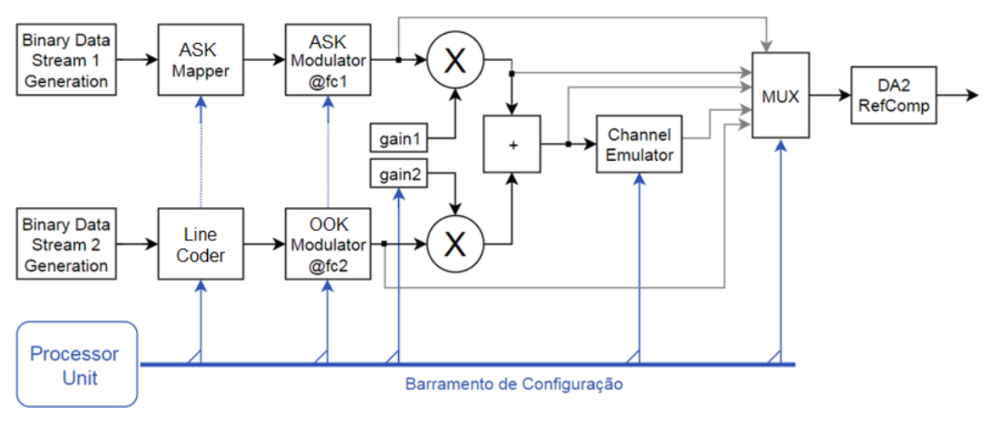
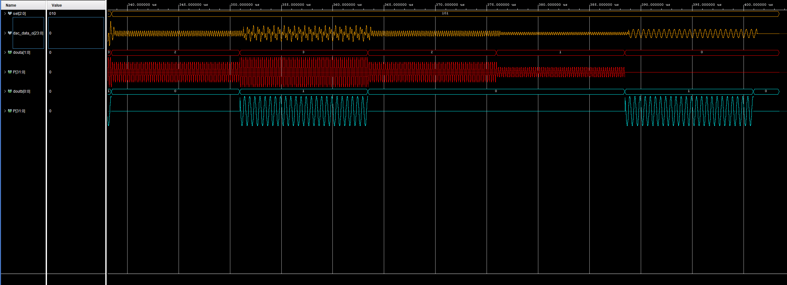

# Relatório de Implementação | Proposta D
## Modulação ASK/OOK Multiplexada na Frequência

Autores: Paulo Sousa | Pedro Ferreira  
Unidade Curricular: Eletrónica Configurável  
Mestrado em Engenharia Eletrotécnica 2025/2026

---

## 1. Introdução e Objetivos Globais

O presente relatório detalha o percurso de desenvolvimento da Proposta D focada na Modulação ASK/OOK Multiplexada na Frequência. O projeto foi segmentado em duas fases distintas. O Projeto 1 compreende a implementação estática do sistema em hardware recorrendo a Programmable Logic. O Projeto 2 prevê a integração com o Processing System para conferir controlo e configuração dinâmica ao desenho.

Os objetivos globais definidos para o sistema base englobam a implementação dos moduladores ASK e OOK no tecido lógico da FPGA e a realização técnica da Multiplexagem por Divisão na Frequência FDM. É exigido garantir o controlo independente dos ganhos associados aos diferentes canais e implementar uma secção responsável pela emulação do meio físico de transmissão. Por fim, delineou-se o requisito de conceber um mecanismo de seleção dinâmica para os sinais intermédios de modo a simplificar o processo de validação, efetuando o encaminhamento dos mesmos para a saída física DAC e para inspeção por Integrated Logic Analyzer.

A Figura 1 ilustra o diagrama de blocos arquitetural estipulado para a Proposta D.

  
Figura 1: Diagrama conceptual da Proposta D.

## 2. Projeto 1: Implementação em Hardware PL

Durante esta primeira fase, os esforços centraram-se na materialização da arquitetura em lógica programável pura. O trajeto percorrido pelos sinais desde as fontes geradoras até ao encaminhamento de saída foi desenvolvido e avaliado recorrendo ao Vivado. A Figura 2 apresenta a visão global da arquitetura implementada.

  
Figura 2: Arquitetura global do sistema.

### 2.1. Geração de Dados e Moduladores

A fase inicial do circuito concentra-se na geração dos dados em banda base e no seu mapeamento em níveis de amplitude. Esta secção do sistema foi desenhada com recurso a Block RAMs e moduladores DDS, conforme visível na Figura 3. 

  
Figura 3: Secção de Geração de Dados com BRAMs e Moduladores DDS.

As Block RAMs foram instanciadas como geradores pseudo-aleatórios. O comportamento cíclico destas fontes é ditado pela iniciação prévia das memórias usando ficheiros de inicialização. No caso do sinal ASK a memória opera em notação hexadecimal de forma a perfazer o padrão pretendido para a modulação. O vetor de inicialização estabelecido foi `0, 1, 2, 3, 0, 3, 1, 2, 1, 0, 3, 2, 3, 2, 1, 0`. A via alocada à modulação OOK é restrita ao espetro binário e contém a sequência `0, 1, 0, 1, 1, 0, 1, 0, 0, 1, 1, 0, 1, 0, 0, 1`.

A conversão dos níveis e o enquadramento na amplitude esperada decorre num bloco ASK Mapper encarregue de garantir os 4 níveis de sinal para modulação. O Line Coder da arquitetura converte o fluxo de bits binários da via OOK. Nas circunstâncias do Projeto 1, o nível de modulação escolhido para o ASK provém exclusivamente dos ficheiros inseridos e não pode transitar em tempo de execução. O sinal OOK encontra-se restrito ao código de linha NRZ pela falta de um comutador dinâmico de execução.

Para acomodar as necessidades da transmissão FDM é imperativo dispor de ondas sinusoidais destinadas a multiplicar o sinal de banda base. Este requisito foi cumprido via geradores Direct Digital Synthesizer. A via do modulador ASK baseia a sua atuação através de uma portadora oscilando a 1 MHz, em contraponto com o sinal OOK que assenta numa portadora ajustada para 2 MHz. 

### 2.2. Ganhos, Multiplicadores e Somador

Após a geração das portadoras, as frequências intersetam-se com as vias advindas das Block RAMs em multiplicadores dedicados, concluindo a etapa da modulação em amplitude. 

  
Figura 4: Multiplicadores, blocos de ganho e somador FDM.

O controlo individual dos ganhos dos canais permite o balanceamento de potência na linha FDM e ocorre em simultâneo com a etapa de modulação. Em virtude do isolamento do sistema em lógica estática nesta fase, os ganhos encontram-se dependentes de blocos de constantes e não podem ser dinamicamente configurados. 

A fusão FDM opera-se no domínio linear num somador digital. Atendendo a que o relógio principal pulsa a uma frequência global de 125 MHz, tornou-se impreterível a ativação das prioridades de pipeline interno do somador, aliviando constrangimentos lógicos e assegurando o fecho das restrições temporais.

### 2.3. Emulação de Canal e Visualização

Na retaguarda da transmissão o sinal atravessa um emulador de canal implementado com um filtro Finite Impulse Response. Este compilador processa os dados segundo a tipologia Single Rate e opera à taxa de amostragem de 125 MHz. O filtro encontra-se configurado como um passa-baixo utilizando os 21 coeficientes simétricos padrão e possui a banda passante programada entre os 0.0 e 0.5 da frequência estipulada, com a banda de rejeição a atuar acima dos 0.5.

  
Figura 5: Filtro FIR de emulação de canal, MUX de visualização e ILA.

A multiplexagem de visualização foi materializada a partir de um MUX combinacional desenhado em VHDL para conduzir qualquer sinal requisitado ao barramento principal. O bloco DA2ref, que permitiria a averiguação prática via osciloscópio, estaria posicionado diretamente à frente do MUX caso estivesse implementado nesta fase. Atualmente o circuito apenas encaminha os dados e aciona a visualização em ferramentas de simulação. 

Como exemplos demonstrativos dos resultados colhidos através de simulação:

Quando acionado o MUX 2 através do bit de seleção 010, observa-se a representação intermédia do sinal ASK patente na Figura 6.

  
Figura 6: Visualização do estado lógico quando MUX 2 é ativado.

Ao transitar para o MUX 3 configurado com o bit 011, é possível verificar a via de sinal correspondente ao modulador OOK, tal como visível na Figura 7.

  
Figura 7: Visualização do estado lógico quando MUX 3 é ativado.

Ao selecionar o MUX 4 utilizando o bit 100, visualiza-se a via do sinal multiplexado conforme demonstra a Figura 8.

  
Figura 8: Visualização do estado lógico quando MUX 4 é ativado.

Avançando para o MUX 5 mediante o bit 101, o observador é exposto à componente final da via, já agregando efeitos de modulação e multiplexagem com o filtro FIR visíveis na Figura 9.

  
Figura 9: Visualização do estado lógico quando MUX 5 é ativado.

Todos os sinais transitam invariavelmente até a um Integrated Logic Analyzer abrindo portas a futuras leituras ao nível da placa de desenvolvimento. Os processos e mapeamentos foram integralmente corroborados recorrendo a ambientes de testbench e as provas de conceito demonstraram a fidelidade estrutural das modulações implementadas.

## 3. Projeto 2: Integração de Hardware e Software PS

(Secção reservada para documentação futura aquando da implementação do processador e dos mecanismos lógicos previstos para o controlo dinâmico do sistema FDM).

## 4. Conclusões

(A conclusão final do documento será elaborada após os testes e relatórios definitivos relativos ao Projeto 2, onde as valências completas da Proposta D se encontrem validadas).
