# Relatório de Projeto | Proposta D
## Modulação ASK/OOK Multiplexada na Frequência

Autores: Paulo Sousa | Pedro Ferreira  
Unidade Curricular: Eletrónica Configurável  
Mestrado em Engenharia Eletrotécnica 2025/2026

---

## 1. Introdução e Objetivos Globais

O presente relatório detalha o desenvolvimento da Proposta D focada na Modulação ASK/OOK Multiplexada na Frequência. O projeto foi segmentado em duas fases distintas. O Projeto 1 compreende a implementação estática do em hardware recorrendo a Programmable Logic. O Projeto 2 prevê a integração com o Processing System para conferir controlo e configuração dinâmica ao desenho.

Os objetivos globais definidos para o sistema base englobam a implementação dos moduladores ASK e OOK no fabric lógico da FPGA e a técnica da multiplexagem por divisão na frequência FDM. É exigido garantir o controlo independente dos ganhos associados aos diferentes canais e implementar uma secção responsável pela emulação do meio físico de transmissão. Por fim, delineou-se o requisito de conceber um mecanismo de seleção dinâmica para os sinais intermédios de modo a simplificar o processo de validação, efetuando o encaminhamento dos mesmos para a saída física DAC e para inspeção por Integrated Logic Analyzer.

A Figura 1 ilustra o diagrama de blocos arquitetural estipulado para a Proposta D.

  
Figura 1: Diagrama conceptual da Proposta D.

## 2. Projeto 1: Implementação em Hardware PL

Durante esta primeira fase, os esforços centraram-se na materialização da arquitetura em lógica programável pura. O trajeto percorrido pelos sinais desde as fontes geradoras até ao encaminhamento de saída foi desenvolvido e avaliado recorrendo ao Vivado. A Figura 2 apresenta a visão global da arquitetura implementada.

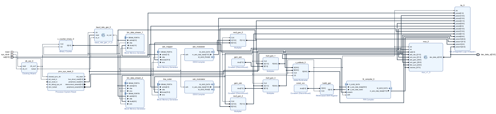  
Figura 2: Arquitetura global do sistema.

### 2.1. Geração de Dados e Moduladores

A fase inicial do circuito concentra-se na geração dos dados em banda base e no seu mapeamento em níveis de amplitude. Esta secção do sistema foi desenhada com recurso a Block RAMs e moduladores DDS, conforme visível na Figura 3. 

  
Figura 3: Secção de Geração de Dados com BRAMs e Moduladores DDS.

As Block RAMs foram instanciadas como geradores pseudo-aleatórios. O comportamento cíclico destas fontes é ditado pela iniciação prévia das memórias usando ficheiros de inicialização. No caso do sinal ASK a memória opera em notação hexadecimal de forma a perfazer o padrão pretendido para a modulação. O vetor de inicialização estabelecido foi `0, 1, 2, 3, 0, 3, 1, 2, 1, 0, 3, 2, 3, 2, 1, 0`. A via alocada à modulação OOK é restrita ao espetro binário e contém a sequência `0, 1, 0, 1, 1, 0, 1, 0, 0, 1, 1, 0, 1, 0, 0, 1`.

A conversão dos níveis e o enquadramento na amplitude esperada decorre num bloco ASK Mapper encarregue de garantir os 4 níveis de sinal para modulação. O Line Coder da arquitetura converte o fluxo de bits binários da via OOK. Nas circunstâncias do Projeto 1, o nível de modulação escolhido para o ASK provém exclusivamente dos ficheiros inseridos e não pode transitar em tempo de execução. O sinal OOK encontra-se restrito ao código de linha NRZ pela falta de um comutador dinâmico de execução.

Para acomodar as necessidades da transmissão FDM é imperativo dispor de ondas sinusoidais destinadas a multiplicar o sinal de banda base. Este requisito foi cumprido via geradores Direct Digital Synthesizer. A via do modulador ASK baseia a sua atuação através de uma portadora oscilando a 1 MHz, em contraponto com o sinal OOK que assenta numa portadora ajustada para 2 MHz. 

### 2.2. Ganhos, Multiplicadores e Somador

Após a geração das portadoras, as frequências intersetam-se com as vias advindas das Block RAMs em multiplicadores dedicados, concluindo a etapa da modulação em amplitude. 

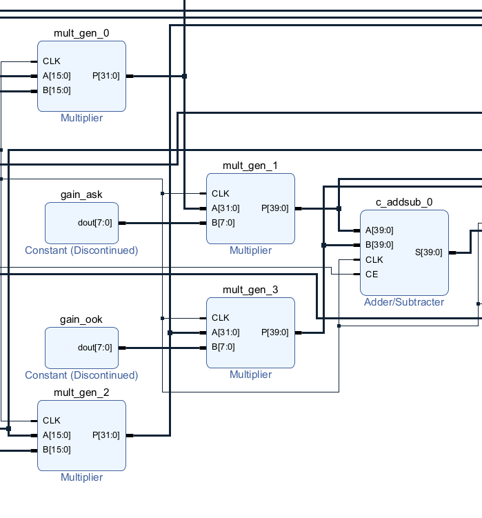  
Figura 4: Multiplicadores, blocos de ganho e somador FDM.

O controlo individual dos ganhos dos canais permite o balanceamento de potência na linha FDM e ocorre em simultâneo com a etapa de modulação. Em virtude do isolamento do sistema em lógica estática nesta fase, os ganhos encontram-se dependentes de blocos de constantes e não podem ser dinamicamente configurados. 

A fusão FDM opera-se no domínio linear num somador digital. Atendendo a que o relógio principal pulsa a uma frequência global de 125 MHz, tornou-se impreterível a ativação das prioridades de pipeline interno do somador, aliviando constrangimentos lógicos e assegurando o fecho das restrições temporais.

### 2.3. Emulação de Canal e Visualização

Depois da transmissão, o sinal passa por um emulador de canal feito com um filtro FIR (Finite Impulse Response). Este IP corre em Single Rate, à taxa de amostragem de 125 MHz. O filtro serve para simular a atenuação de alta frequência que acontece num canal real (fading seletivo), e foi desenhado com o algoritmo de Parks-McClellan . Tem 121 coeficientes, de 16 bits, com banda passante até 1.1 MHz e banda de rejeição a começar nos 1.9 MHz. Com isto, o canal ASK (1 MHz) passa sem distorção, enquanto o canal OOK (2 MHz) fica atenuado cerca de 32 dB, simulando as perdas do canal de transmissão.

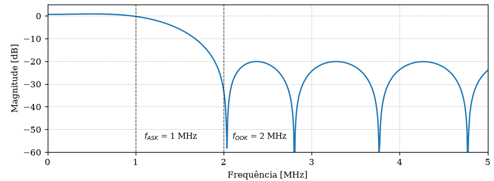  
Figura 5: Resposta em frequência e impulso do filtro FIR calculado.

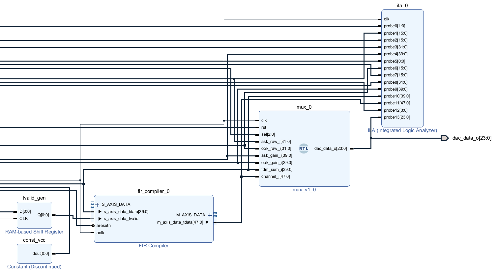  
Figura 6: Filtro FIR de emulação de canal, MUX de visualização e ILA.

A multiplexagem de visualização foi materializada a partir de um MUX combinacional desenhado em VHDL para conduzir qualquer sinal requisitado ao barramento principal. O bloco DA2ref, que permitiria a averiguação prática via osciloscópio, estaria posicionado diretamente à frente do MUX caso estivesse implementado nesta fase. Atualmente o circuito apenas encaminha os dados e aciona a visualização em ferramentas de simulação. 

Como exemplos demonstrativos dos resultados colhidos através de simulação:

Quando acionado o MUX 2 através do bit de seleção 010, observa-se a representação intermédia do sinal ASK patente na Figura 7.

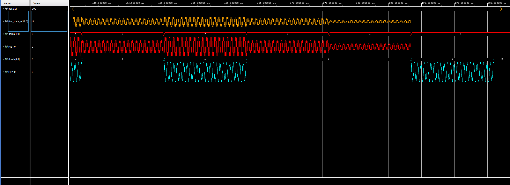  
Figura 7: Visualização do estado lógico quando MUX 2 é ativado.

Ao transitar para o MUX 3 configurado com o bit 011, é possível verificar a via de sinal correspondente ao modulador OOK, tal como visível na Figura 8.

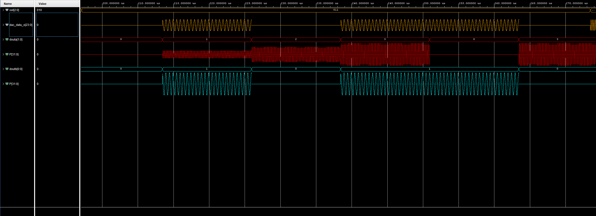  
Figura 8: Visualização do estado lógico quando MUX 3 é ativado.

Ao selecionar o MUX 4 utilizando o bit 100, visualiza-se a via do sinal multiplexado conforme demonstra a Figura 9.

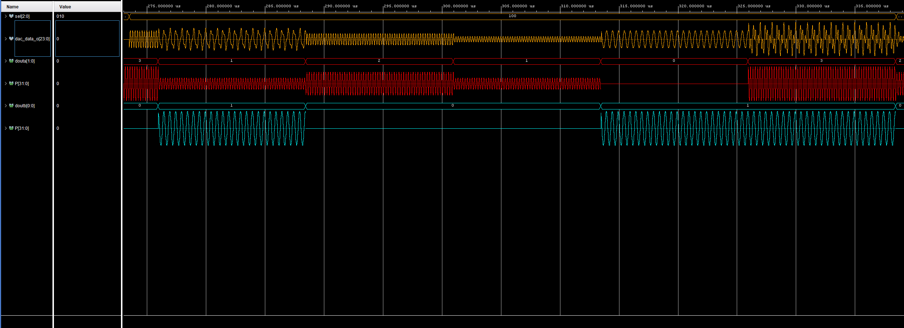  
Figura 9: Visualização do estado lógico quando MUX 4 é ativado.

Selecionando o MUX 5 com o bit 101, vemos a componente final da via. Aqui dá para ver o efeito direto do filtro FIR do emulador de canal: o ASK mantém-se praticamente igual, enquanto o OOK aparece bastante atenuado. Esta diferença confirma o comportamento seletivo do canal, como se vê na Figura 10.

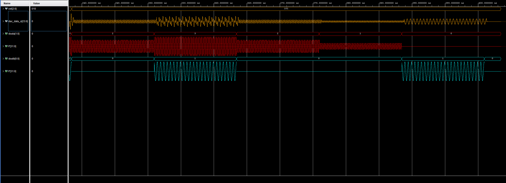  
Figura 10: Visualização do estado lógico quando MUX 5 é ativado.

Todos os sinais transitam invariavelmente até a um Integrated Logic Analyzer abrindo portas a futuras leituras ao nível da placa de desenvolvimento. Os processos e mapeamentos foram integralmente corroborados recorrendo a ambientes de testbench e as provas de conceito demonstraram a fidelidade estrutural das modulações implementadas.
## 3. Projeto 2: Integração de Hardware e Software PS

A segunda fase do projeto consiste na inserção do PS e na sua interligação com a PL. Este passo permite o controlo dos parâmetros de modulação e multiplexagem em tempo de execução.

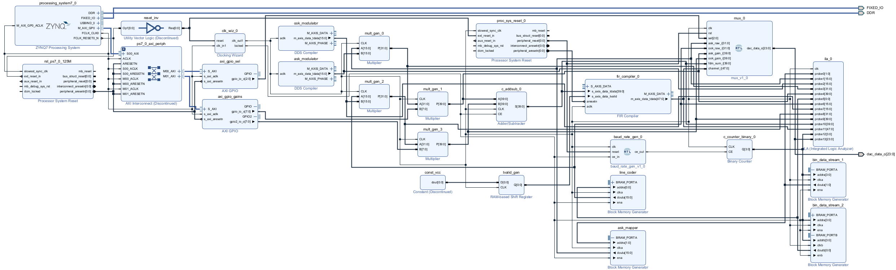
Figura 11: Diagrama de blocos do sistema.

### 3.1. Sistema de Processamento e Barramento (Zynq PS e AXI Interconnect)

O processador atua como master na comunicação. O IP `processing_system7_0` fornece o sinal de relógio principal (`FCLK_CLK0`), de 125 MHz, e o sinal de reset de toda a parte logica. O PS tem como base um processador com arquitetura ARM e interage com memórias e periféricos, corre o sistema operativo Linux. A comunicação entre o processador e a FPGA é feita através de um IP AXI Interconnect, que traduz commandos de memória do PS em transações AXI4-Lite dirigidas aos periféricos slave (implementados no fabric fpga).

Figura 12: Detalhe do Zynq PS e interligação com os módulos AXI GPIO.

### 3.2. Controladores de Periféricos (AXI GPIO)

Os blocos AXI GPIO funcionam como interface de modificação dos parâmetros dos caminhos de dados da modulação FDM, configurados como slaves AXI. O `axi_gpio_sel` tem um único canal, com largura de 3 bits, ligado à entrada de seleção (`sel`) do multiplexador RTL. O `axi_gpio_gains` está configurado em dual channel, com os canais 1 e 2 a funcionar com largura de 8 bits: o canal 1 controla o ganho do ASK e o canal 2 o ganho do OOK.

O funcionamento interno dos GPIOs consiste em manter o valor recebido na porta AXI e na sua ligação aos pinos físicos ligados à lógica. A interação com o PS ocorre por Memory-Mapped I/O: cada escrita gera uma transação de 32 bits no barramento AXI, da qual apenas utiliza-mos o valor de 8 bits.

Figura 13: Mapeamento de memória no Address Editor do Vivado.

Os parâmetros configuráveis via GPIO são o ganho aplicado ao somador e o canal selecionado no multiplexador. Mudar estes valores muda o balanceamento de potência entre vias e o comportamento das saídas intermédias.

### 3.3. Sincronização e Geração de Baud Rate

O relógio do sistema vem do PS e tem frequência de 125 MHz. As portadoras usadas andam na ordem de 1 MHz e 2 MHz. Se a sequência em banda base for lida a 125 MHz, esta sobrepõe-se à portadora e o sinal modulado sai distorcido. Por isso foi criado o bloco `baud_rate_gen.vhd`, que faz a divisão do relógio.

Este módulo gera uma nova taxa de leitura e escrita (baud rate) para as memórias BRAM. As entradas são o relógio do sistema e um reset síncrono; a saída é um impulso digital (Clock Enable). Por dentro, tem um contador síncrono que conta ciclos de relógio; quando chega aos 1250 ciclos, o impulso de saída fica a 1 lógico. Este bloco não fala com o barramento do PS. Com este divisor, a baud rate do sistema FDM fica em 100 kHz.

### 3.4. Interface de Software PYNQ

O sistema é controlado a partir de uma aplicação Python na framework PYNQ. A aplicação carrega o bitstream (`.bit`) e o ficheiro com a descrição de hardware (`.hwh`). A biblioteca `pynq.Overlay` serve para instanciar o overlay e aceder aos endereços dos módulos `axi_gpio_sel` e `axi_gpio_gains`.

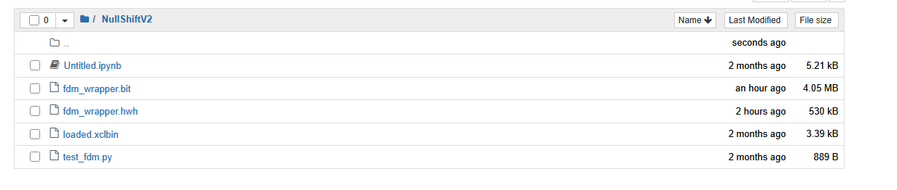
Figura 14: Interface de gestão no ambiente Linux PYNQ.

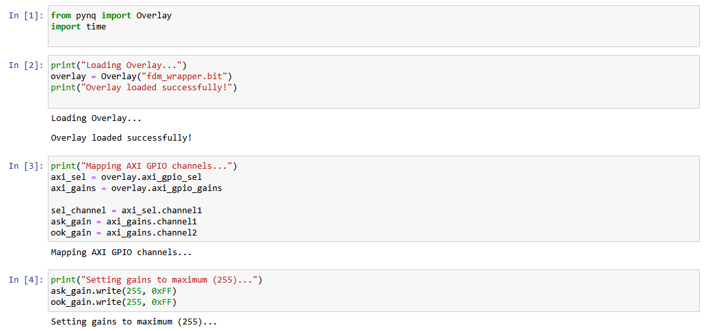
Figura 15: Escrita de registos AXI Lite via Jupyter Notebook.

Os scripts escrevem diretamente nas portas físicas através do barramento (por exemplo, escrever o valor 255 corresponde a mandar um pacote de 32 bits, `0x000000FF`, pelo AXI Interconnect).

O controlo dinâmico do multiplexer e dos ganhos dos canais ASK e OOK foi testado no ambiente PYNQ, permitindo reconfigurar o sistema sem recompilar o hardware. No entanto, por instabilidades no ambiente de simulação e na interface do Vivado, não foi possível recolher e analisar as formas de onda em simultâneo com a variação destes parâmetros. Esta limitação foi agravada pela não implementação do bloco DAC na etapa final da cadeia de transmissão, o que impediu verificar os sinais com um osciloscópio físico.

## 4. Conclusões

O desenvolvimento da Proposta D exigiu um trabalho de integração significativo entre a lógica programável (PL) e o processador (PS), com bastante rigor na parte de comunicação digital em hardware. Por limitações de tempo, não foi possível implementar todas as funcionalidades planeadas, como a interface DAC para emitir o sinal modulado e a validação final em placa. Ainda assim, o sistema desenvolvido até este ponto mostra que a arquitetura definida funciona como previsto.

O trabalho permitiu consolidar competências práticas de co-design entre PL e PS: desde a criação dos geradores e moduladores de sinal na FPGA até ao controlo de registos e parâmetros via barramento AXI no ambiente PYNQ (Linux). Isto cobre o objetivo principal da unidade curricular.