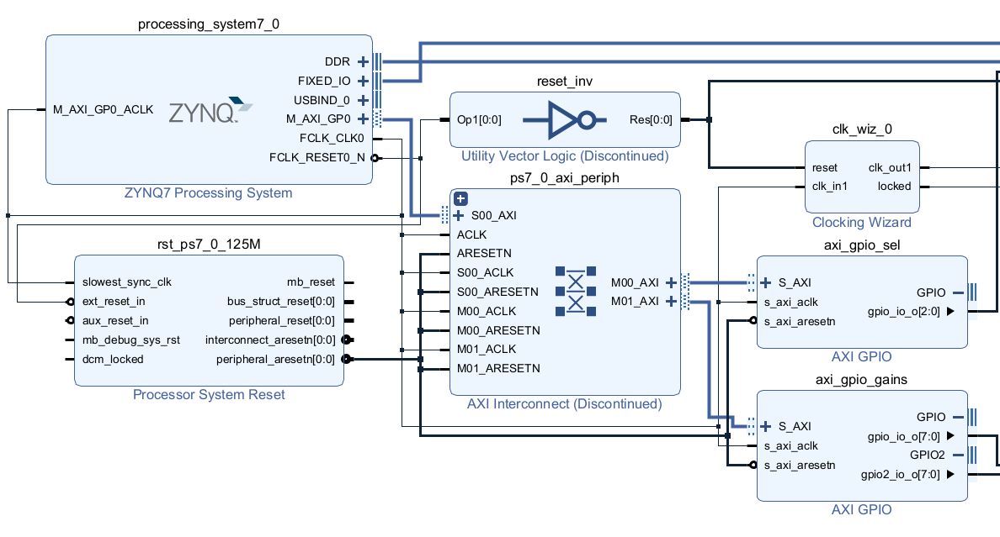
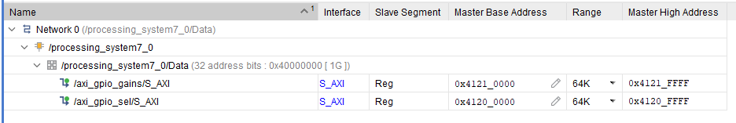
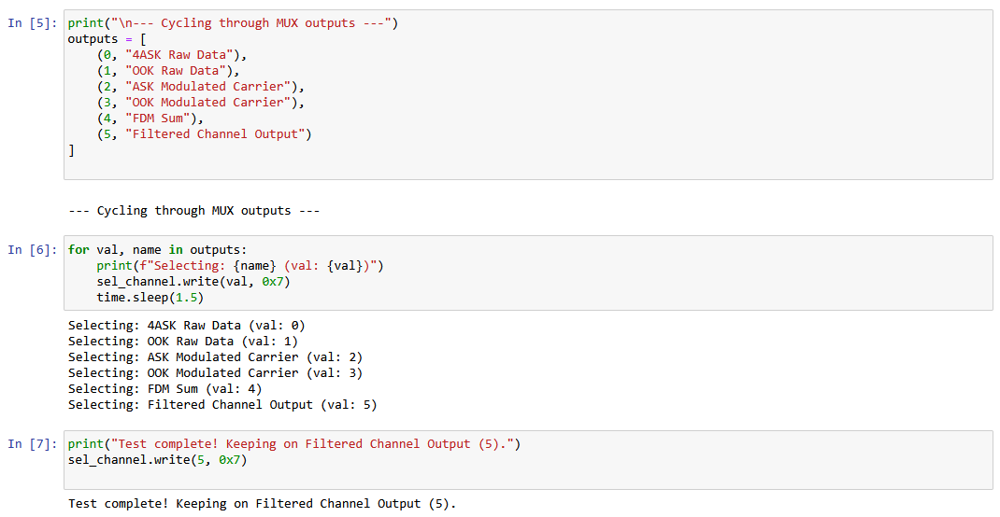

---

marp: true
theme: default
paginate: true
header: 'Projeto 2: Integração Zynq SoC e AXI GPIO'
footer: 'Eletrónica Configurável | Mestrado em Engenharia Eletrotécnica 2025/2026' 

---

# Projeto 2 | Proposta D 
### Integração Zynq SoC e AXI GPIO

*Autores:*
Paulo Sousa | Pedro Ferreira

*Unidade Curricular:*
Eletrónica Configurável
Mestrado em Engenharia Eletrotécnica - 2025/2026

---

## Objetivos

- Uso conjunto da lógica programável - PL e do processador ARM - PS.
- Parâmetros de modulação controlados por AXI lite, em python.
- Ganhos e seleção do MUX ajustáveis.

---

---

## Zynq PS & PL

Block Design reestruturado para incluir o processing system:

- **Zynq PS (`processing_system7_0`)**: mestre AXI, clock principal (125 MHz) e reset.
- **AXI Interconnect**: mapeia memória entre CPU e a FPGA.
- **AXI GPIO (slaves)**:
  - `axi_gpio_sel`: 3 bits, seleção do MUX RTL.
  - `axi_gpio_gains`: dual channel, 8 bits (canal 1 = ASK, canal 2 = OOK), configuração de ganhos.

---

---

## Comunicação PS → PL

Feita por escrita/leitura de registos mapeados em memória.

- Endereços: `axi_gpio_sel`, `axi_gpio_gains`

---

## Interface Software

ARM corre PYNQ em linux

- A compilação gera bitstream (`.bit`) e hardware handoff (`.hwh`).
- controlo via Jupyter Notebook no browser

---

## Parametrização em Python

`pynq.Overlay` carrega o bitstream e expõe os barramentos a partir do `.hwh`.

Escritas nos registos feitos com mascaras binárias.

Python escreve o valor 255 ->  pacote de 32 bits de largura (0x000000FF) através do AXI Interconnect

---

---

## Sincronização

O relógio gerado pelo PS (`FCLK_CLK0`) corre a **125 MHz**. 

- Se os geradores Baseband corressem a 125 MHz, o sinal de dados seria mais rápido que as portadoras de 2 e 5 MHz.
- Introdução de um Divisor de Relógio em VHDL
- Agora as BRAMs enviam os bits a **100 kHz**...

---

## Conclusão

- Validado processamento na FPGA + controlo via Python.
- Ganhos e seleção do MUX ajustáveis em runtime, sem recompilar a bitstream.
- Protótipo 60% funcional, não foi possivel completar todos os testes.