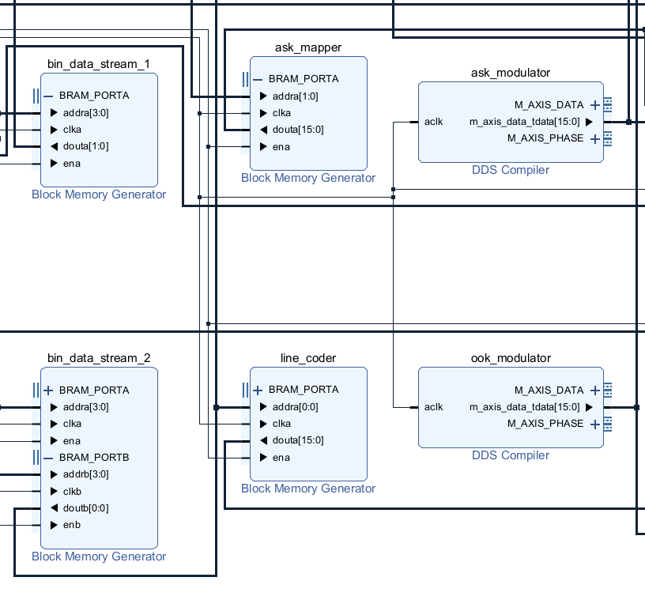
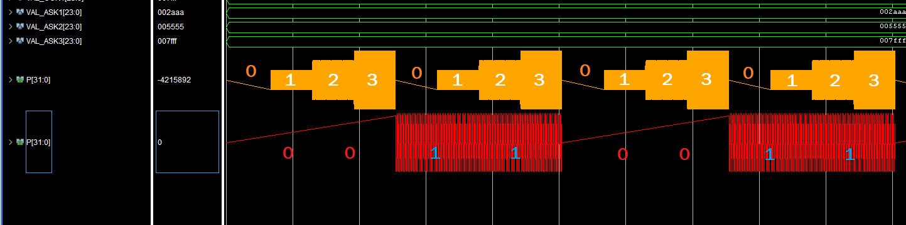
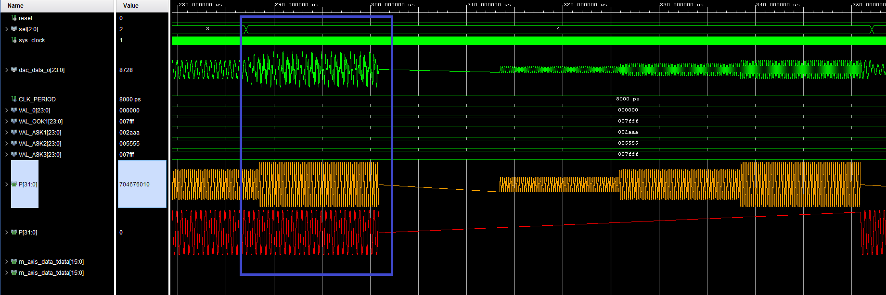
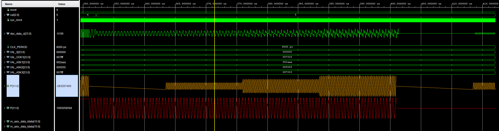
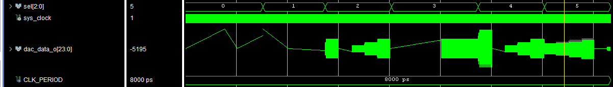

---

marp: true
theme: default
paginate: true
header: 'Projeto 1: Modulação ASK/OOK Multiplexada na Frequência'
footer: 'Eletrónica Configurável | Mestrado em Engenharia Eletrotécnica 2025/2026' 

---

# Projeto 1 | Proposta D 
### Modulação ASK/OOK Multiplexada na Frequência

**Autores:**
Paulo Sousa | Pedro Ferreira

**Unidade Curricular:**
Eletrónica Configurável
Mestrado em Engenharia Eletrotécnica 2025/2026

---

## Objetivos

- Moduladores ASK e OOK em PL.
- Multiplexagem por Divisão na Frequência.
- Controlo de ganhos.
- Emulação de canal físico.
- Seleção de sinais para visualização no DAC/ILA.

---

## Arquitetura do Sistema 1
1. **Geração e Mapeamento**: BRAMs, com OOK (2-ASK) e ASK (4-ASK).
2. **Portadoras**: Geradores DDS.

---

## Arquitetura do Sistema 2

3. **Modulação e Ganho**: Blocos multiplicadores.
4. **Multiplexagem FDM**: Somador digital.

---

## Arquitetura do Sistema 3

5. **Emulação de Canal**: Filtro FIR.
6. **Visualização**: MUX combinacional em VHDL.

---

## Geração das Portadoras

- Geração precisa de sinusóides digitais.
- Frequência da Portador no **ASK Modulator**: 5 MHz
- Frequência da Portadora no **OOK Modulator**: 2 MHz

---

## Geração de Dados e Mapeamento

- Ficheiros `.coe` simulam geradores pseudo-aleatórios.
- **ASK Mapper**: Converte bits em 4 níveis de amplitude.
- **Line Coder**: Converte stream binária OOK para formatos exigidos.

---

## Multiplexagem FDM

- Operação `A + B` para sobreposição linear dos canais ASK e OOK.
- Configuração de *Pipeline* interno ativada para garantir o fecho de *timing constraints* a 125 MHz.

---

## Emulador de Canal

- Restrição de banda e distorção programada com compilador FIR.

---

## Visualização

- Bloco combinacional com instrução `case` para seleção dinâmica.
- Encaminha o sinal selecionado para o barramento `dac_data_o`.
- Todos os sinais anteriores disponíveis no ILA.

